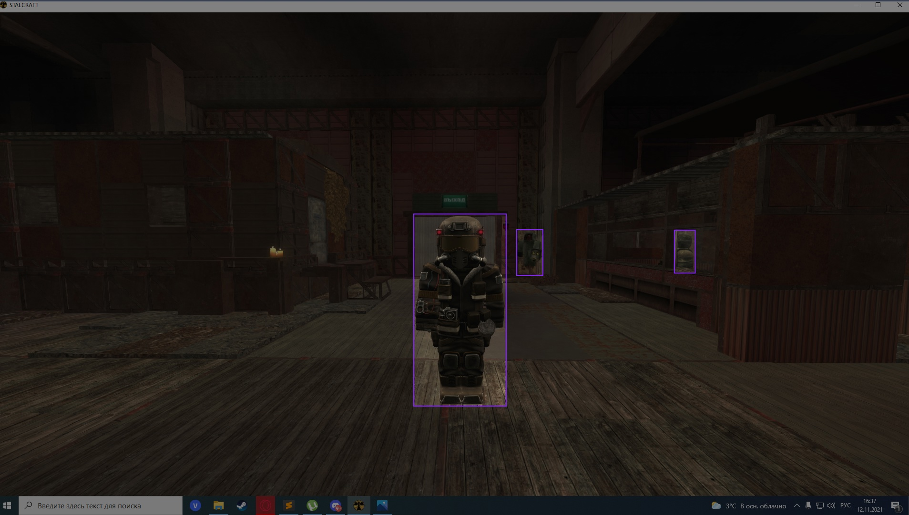
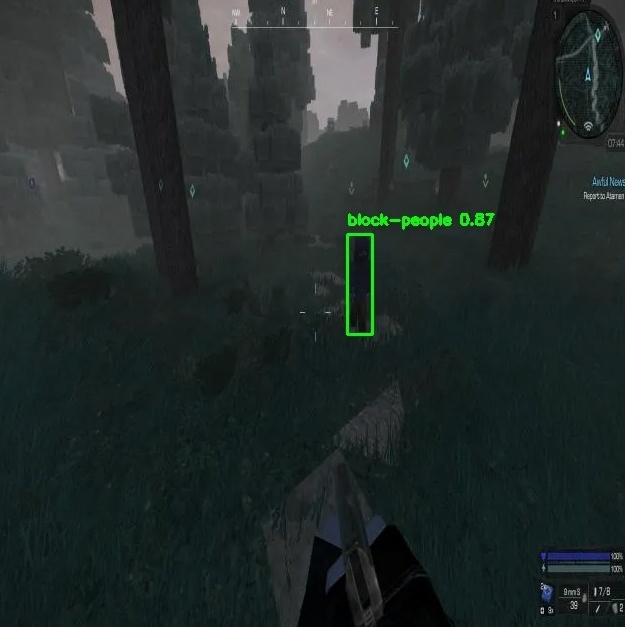

# StalCraft Models Detection

## Идея
Идея была спонтанной (пару знакомых товарищей играют в STALCRAFT). Захотелось попробовать рассмотреть задачу CV - а именно задача детекции моделей человека в игре STALCRAFT. 
*Цель*:  Сделать приложение с минимальным UI на базе gradio для данной задачи.
*Датасет* - https://universe.roboflow.com/michael-gorrg/stalcraft-flcil. Это скриншоты и фото от разных пользователей, сделанных в игре.


## Структура проекта
```
📂 StalCraft-Detection
├── 📂 configs							# Директория с основным конфигурационным файлом
│   └── ⚙️ parameters_file.yaml					# Основной конфигурационный файл
├── 📂 data							# Директория с данными 
│   ├── ⚙️ dataset.yaml						# Конфигурационный файл для обучения YOLO
│   ├── 📂 images						# Директория с картинками
│   └── 📂 labels						# Директория с аннотациями объектов для обучения YOLO					
├── 🐍 app.py							# Скрипт приложения на gradio
├── 🐍 infer.py							# Скрипт для инференса 
├── 🐍 train.py							# Скрипт для обучения
├── 🐍 utils.py							# Скрипт с утилзами
├── 🐍 download.py						# Скрипт для скачивания датасета
├── 📝 README.md
└── 📄 requirements.txt					
```
##  Запуск
Установка, использование и запуск:
1. Активировать виртуальное окружение 
``` pip3 install -r requirements.txt```

2. Скачать датасет. Для этого необходимо сделать следующее:
	* Зарегистрироваться на сайте [Roboflow](https://universe.roboflow.com/)
	* Перейти по ссылке для скачивания датасета [Dataset](https://universe.roboflow.com/michael-gorrg/stalcraft-flcil/dataset/9/download), выбрать Download Dataset->Show download code
	* Скопировать API-ключ из поля api_key: `rf = Roboflow(api_key="████████████████")`
	* Выполнить скрипт: `python3 download.py` и вставить в необходимое поле скопированный ключ.
Данные будут распологаться в директории data.
3.  Для дообучения новыми данными всех используемых YOLO-моделей, необходимо выполнить следующее:
```python3 train.py --config configs/parameters_file.yaml```
Результаты обучения будут находиться по пути: `/my_project/models/model_name`

4. Инференс модели: ```python3 infer.py --config configs/parameters_file.yaml --model yolov8s```
Для того, чтобы указать картинку, для которой делается инференс, необходимо поменять/указать путь в поле `image_paths`.  Для корректного завершения скрипта необходимо нажать `0` во время просмотра изображения.

5. Запуск приложения: ```python3 app.py --config configs/parameters_file.yaml --model yolov8s```
Приложение будет находиться на: `http://127.0.0.1:7860`

Вместо yolov8s можно прописать yolov8l, yolov8m соответственно. 
	

Используются модели yolo8s, yolo8l, yolo8m из библиотеки ultralytics.

## Описание конфигурационного файла
Основной для запуска файл: `parameters_file.yaml`. Его структура следующая:
```
data:
	json_path: "data/train/_annotations.coco.json" # Путь до JSON-файла с аннотациями
	images_dir: "data/images" # Путь до директории с изображениями
	labels_dir: "data/labels" # Путь до директории с описанием bbox-ов
	yaml_path: "data/dataset.yaml" # Путь до YAML-файла для конфигурации YOLO

training:
	epochs: 50 # Количество эпох
	batch: 8 # Размер батчка
	imgsz: 640 # Размер изображения
	project: "my_training/models" # Путь до родительской директории с результатами обучения
	name: "" # Имя директории с результатами обучения

inference:
	image_paths: # Путь до изображения для инференса
	- "data/images/test/Screenshot-2023-01-19-091442_png.rf.6b7c7a0777c09b47d9bd08bc0e5cde2d.jpg" 
	conf: 0.5 # Confidence score

pretrained_models: # Список используемых моделей
	- yolov8s.pt
	- yolov8m.pt
	- yolov8l.pt
```


## Результат
Результаты на тестовых изображениях: 
1.  mAP50 ≈ 0.957
2. mAP50-95 ≈ 0.694


